<h1 style="display: flex; align-items: center; gap: 12px;">
  
  Rovis Gym
</h1>

A pretty dumb, private by design, offline, workout tracker for iPhone and Apple Watch. No account, no subscription, no stranger feeds, no AI - just a tool to log your rep x set, weights, rest times and heart rate (if you have an Apple Watch)

Let your watch handle the rest timer and heart-rate capture without unlocking your phone. See your progress over time per exercise. Export in readable formats.

## Why?

- You already know the workouts you want to do. You don't want a coach in your pocket.
- There's no library of exercises to scroll through, and that's on purpose. Type in any name *incline bench*, *weird cable thing*, whatever you call it and start logging reps x sets.
- You don't want anyone else seeing how weak your knees felt today, or how tired you were on that last set.
- You don't need an AI telling you to *push harder* or *try 5 more reps*.
- You're a private human being. Your training is between you and the iron.

## What's in the box

- Add exercises and log sets with weight + reps in a single screen.
- Start a workout > Tap Rest > Log a Set > Start Next Session > Repeat Sets > Done.
- Apple Watch companion that runs the timer and records heart rate during sets. Keep your phone in the locker while you workout.
- Lock-screen Live Activity for the active session.
- Per-exercise progress chart with selectable metrics (top set weight, total volume, etc.).
- Optional heart rate during sets via Apple Watch. Toggle it off any time in Settings > Heart Rate.
- Optional diagnostic logs to help if something's broken. Only kept when you ask; logs never leaves your phone unless you tap Share.
- Export your workout history as JSON, CSV, or plain text. 

## Screenshots

### iPhone

  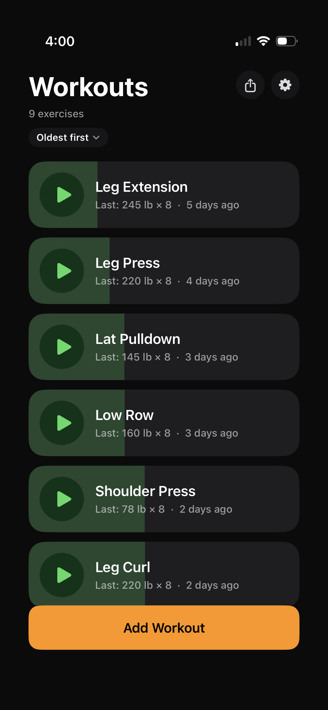
  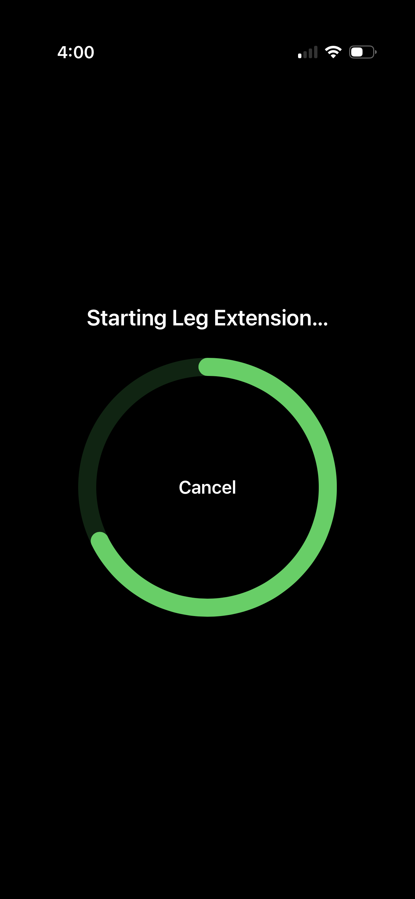
  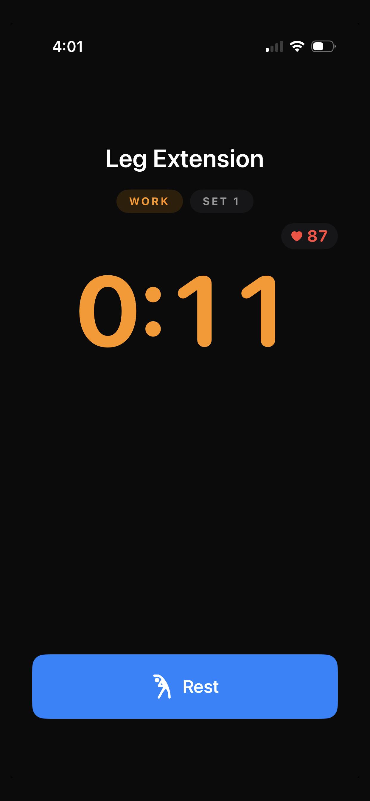
  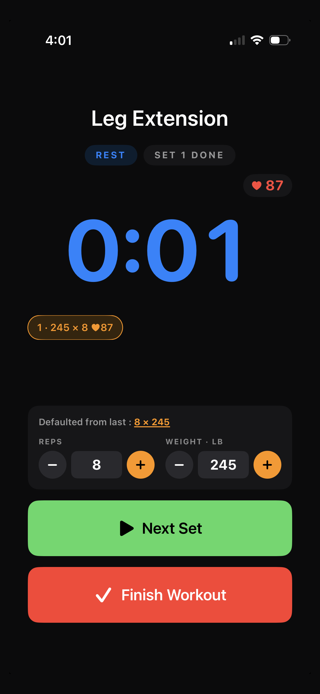
  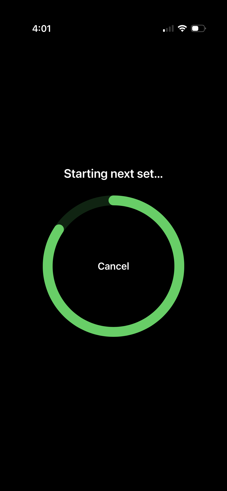
  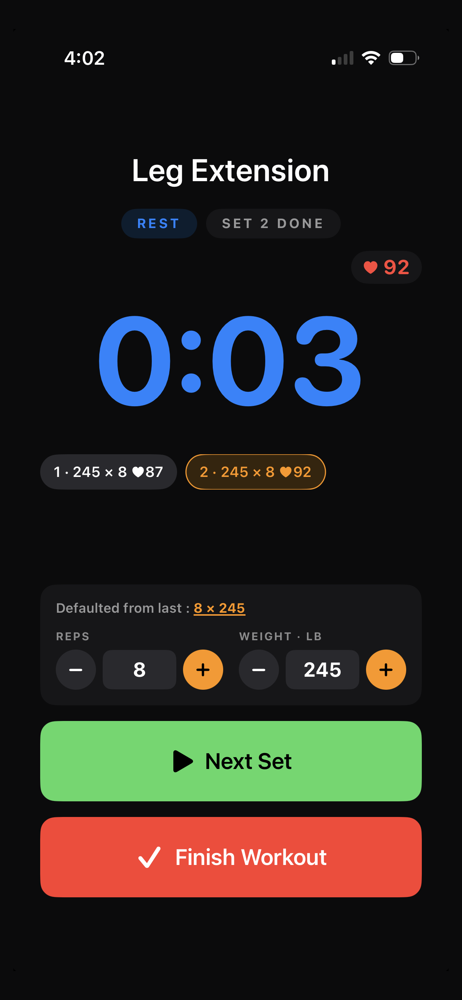
  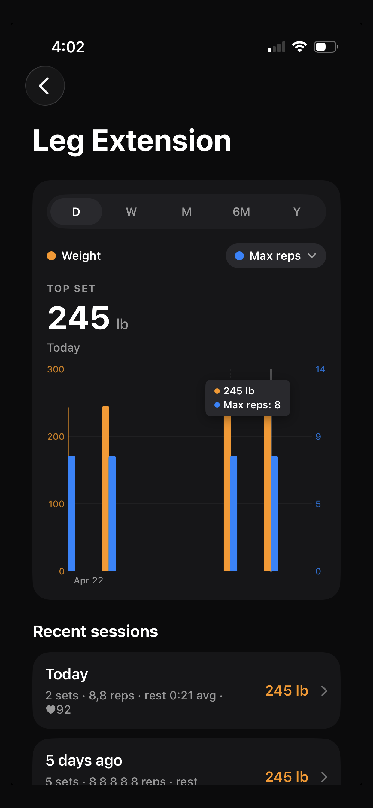
  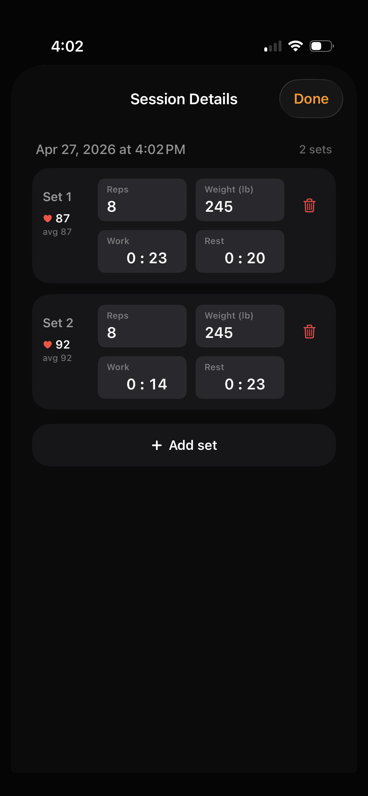
  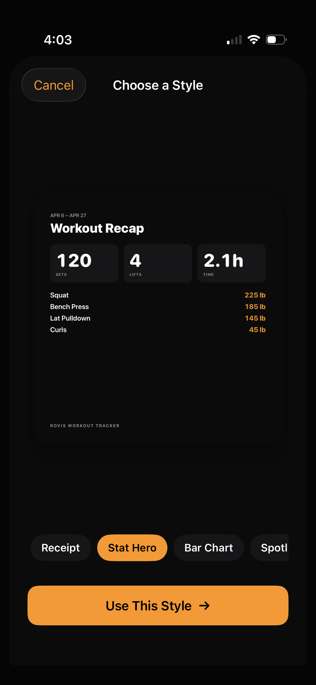
  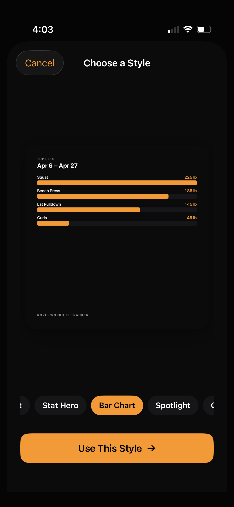
  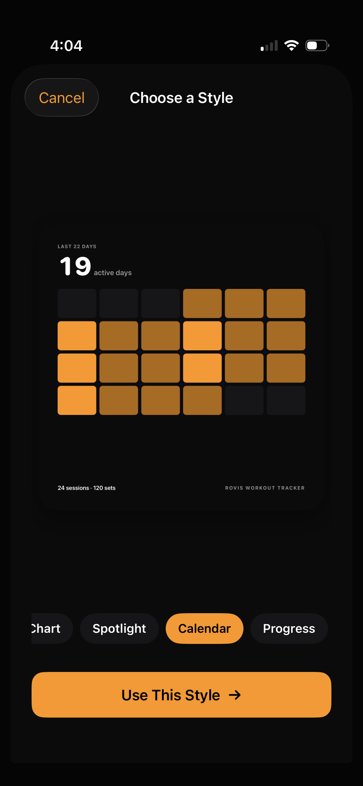
  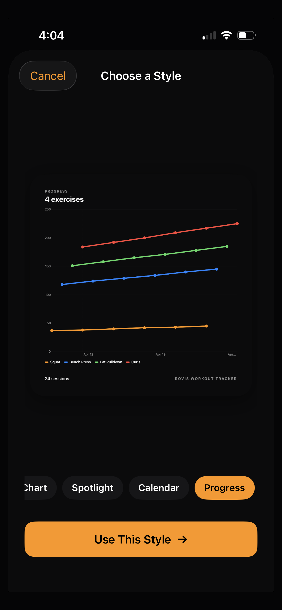
  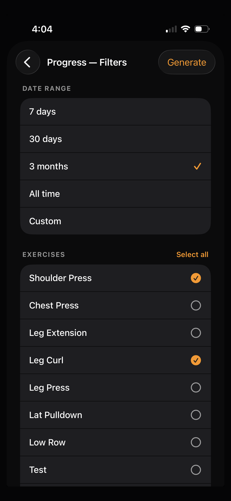

### Apple Watch

  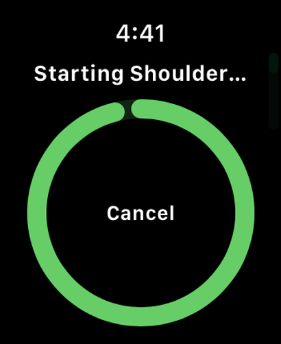
  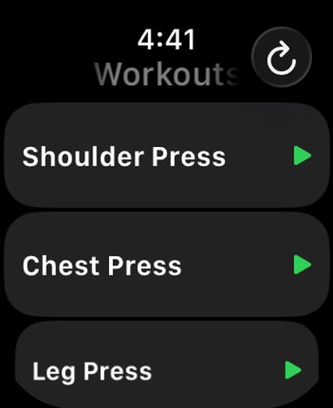
  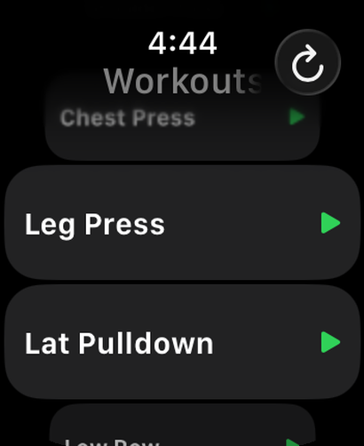
  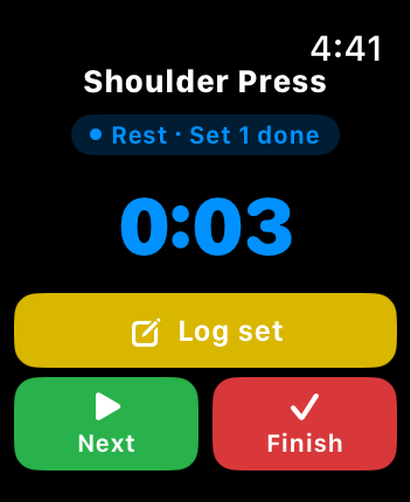
  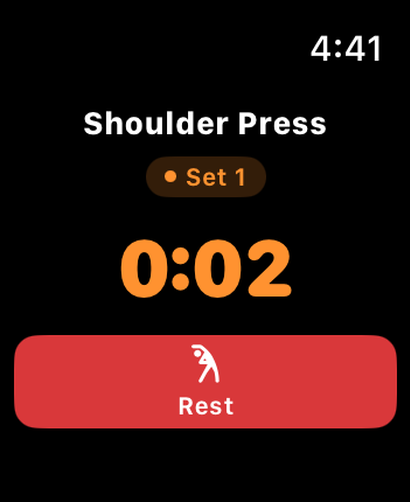

## Links

- [Privacy Policy](privacy.html)
- [Support](support.html)
